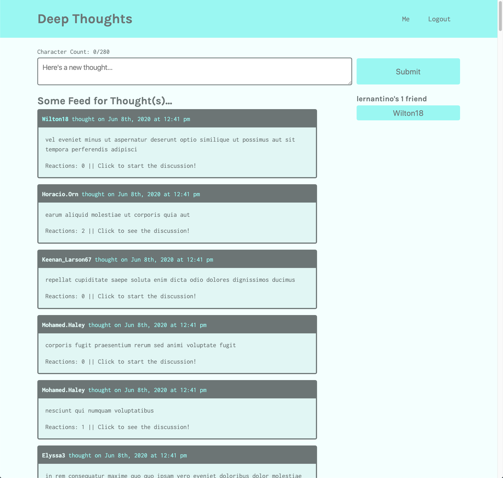

# MERN Stack: Deep Thoughts

## Table of Contents

- [Description](#description)
- [Technology](#Technology)
- [Installation](#installation)
- [Usage](#usage)
- [License](#license)
- [Contribution](#contribution)
- [Test Instructions](#test-instructions)
- [Questions](#questions)

## Description:

Deep Thoughts is a social media application where users can create an account, post their thoughts for others to see, and interact with other users through these thoughts.

## Technology:

Project is created with:

- MongoDB
- Express.js
- React.js
- Node.js
- GraphQL
- JWT Authentication
- Bcrypt.js
- Faker.js

## Installation

To run this project, install it locally using npm: `npm install`

#### Project Creating Process:

- ##### In server directory:

```sh
npm i
npm run seed
npm i apollo-server-express graphql
npm install jsonwebtoken
npm run watch
```

- ##### At the root of the application

```sh
npx create-react-app client
```

- ##### In client directory:

```sh
npm i @apollo/client graphql
npm install react-router-dom
npm install jwt-decode
npm start
```

Open package.json file in the client directory, add the following code at the top:

```json
"proxy": "http://localhost:3001",
```

- ##### At to the root directory

```sh
npm init -y
# install concurrently library as a dependency for development environment only
npm install -D concurrently
```

Open package.json and add/edit the scripts:

```json
"scripts": {
  "start": "node server/server.js",
  "develop": "concurrently \"cd server && npm run watch\" \"cd client && npm start\"",
  "install": "cd server && npm i && cd ../client && npm i",
  "seed": "cd server && npm run seed"
}

"main": "server/server.js",
```

## Usage

After installing npm packages, the application will be invoked by using the following command:

```
npm run develop
```

### Deployment

[Click me to see the app!](https:)

### Example Screenshot



## License

[](https://opensource.org/licenses/MIT) <br>
This project is licensed under MIT, for more information please visit [this website](https://opensource.org/licenses/MIT)

## Contribution

Made by Wenwen Tian

## Test Instructions

To run tests for this application, you can run the following command:

```
npm run test
```

## Questions?

Please feel free to contact me if you need any further information:

- [Email](wwtian9@gmail.com)
- [Github Profile](https://github.com/joce1ynn)
